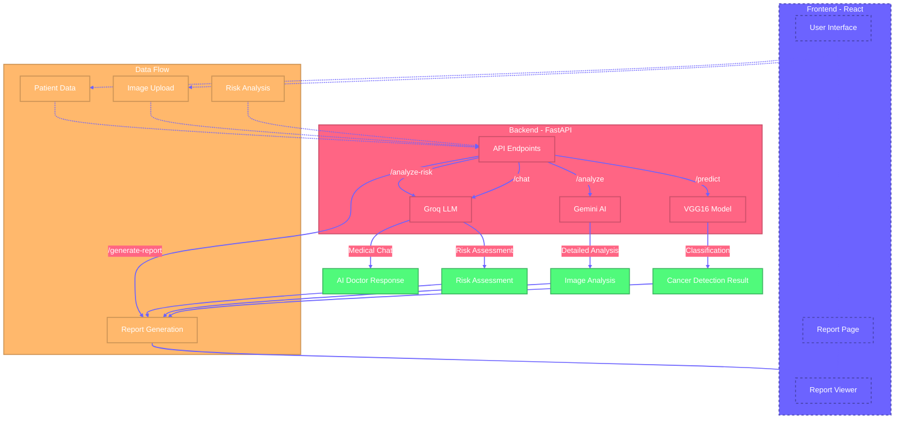

# Lung Cancer Detection System Workflow

## System Components

### Frontend (React)
- User Interface for interaction
- Report Page for data input
- Report Viewer for displaying results

### Backend (FastAPI)
- API Endpoints for various functionalities
- VGG16 Model for cancer detection
- Gemini AI for detailed image analysis
- Groq LLM for risk assessment and chat

### Data Flow
- Image Upload and Processing
- Patient Data Collection
- Risk Analysis
- Report Generation

## Key Features
1. **Cancer Detection**
   - Image-based detection using VGG16
   - Detailed analysis using Gemini AI
   - Confidence scoring

2. **Risk Assessment**
   - Patient data analysis
   - Risk factor identification
   - Personalized recommendations

3. **Report Generation**
   - Comprehensive medical reports
   - Integration of all analysis results
   - Structured data presentation

4. **AI Doctor Chat**
   - Interactive medical consultation
   - Educational resources
   - Real-time responses

## Technical Stack
- Frontend: React with Material-UI
- Backend: FastAPI
- AI Models: VGG16, Gemini, Groq
- Data Processing: TensorFlow, PIL
- Containerization: Docker 